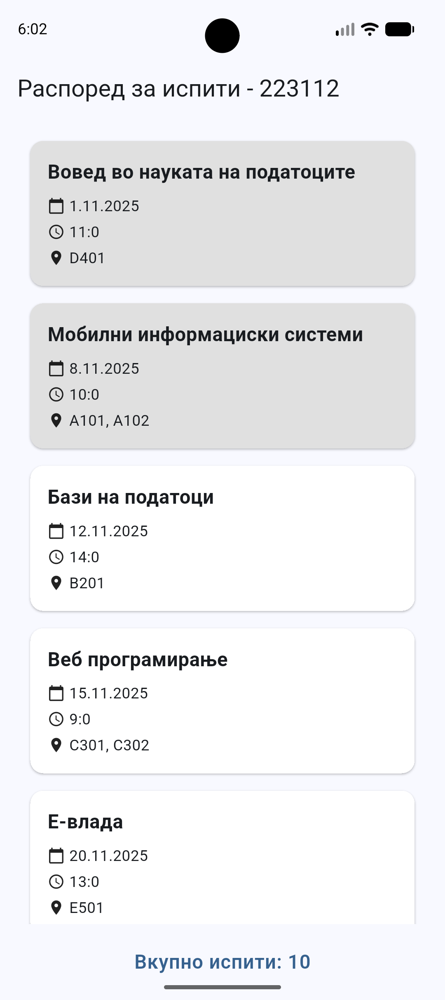
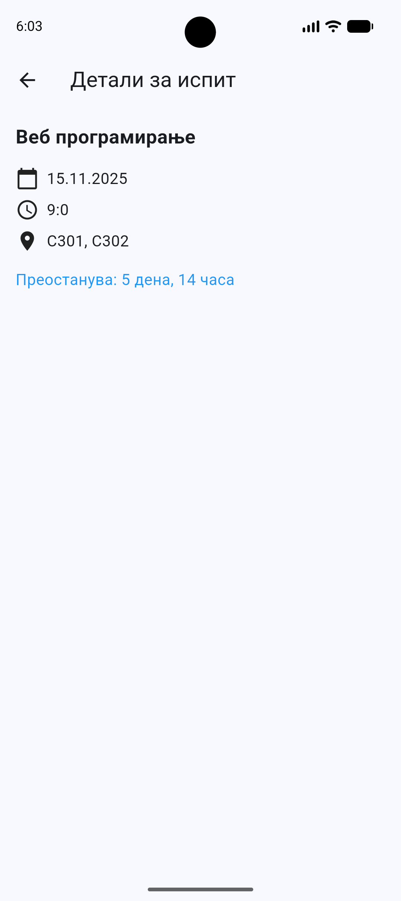
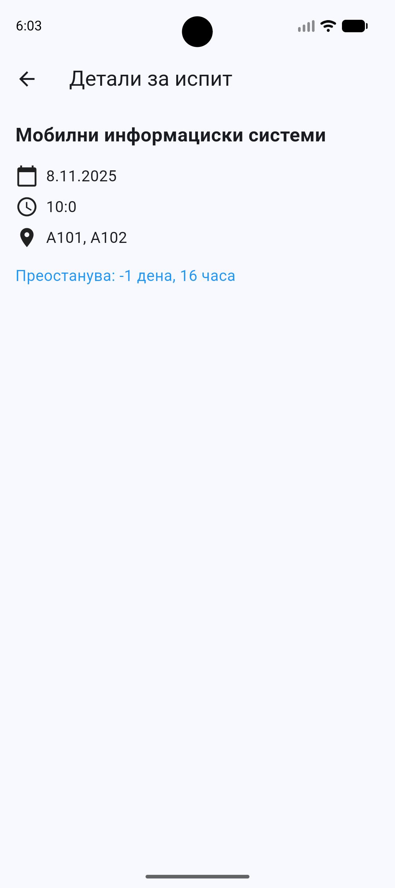

# Exam Timetable App (Flutter)

A Flutter mobile application that displays an official exam timetable provided by professors.  
The app allows students to view upcoming exams and see how much time is left until each exam, or whether an exam has already passed.

---

## Features

- Display exam timetable provided by professors  
- Show exam details such as subject, date, time, and location  
- Countdown showing time remaining until an exam  
- Status indicator for past exams  
- Clear and simple user interface optimized for students  
---

## Technologies Used

- Flutter (Dart)
- Material Design

---

## Screenshots

### Timetable Overview

### Upcoming Exam Countdown

### Exam that has passed

